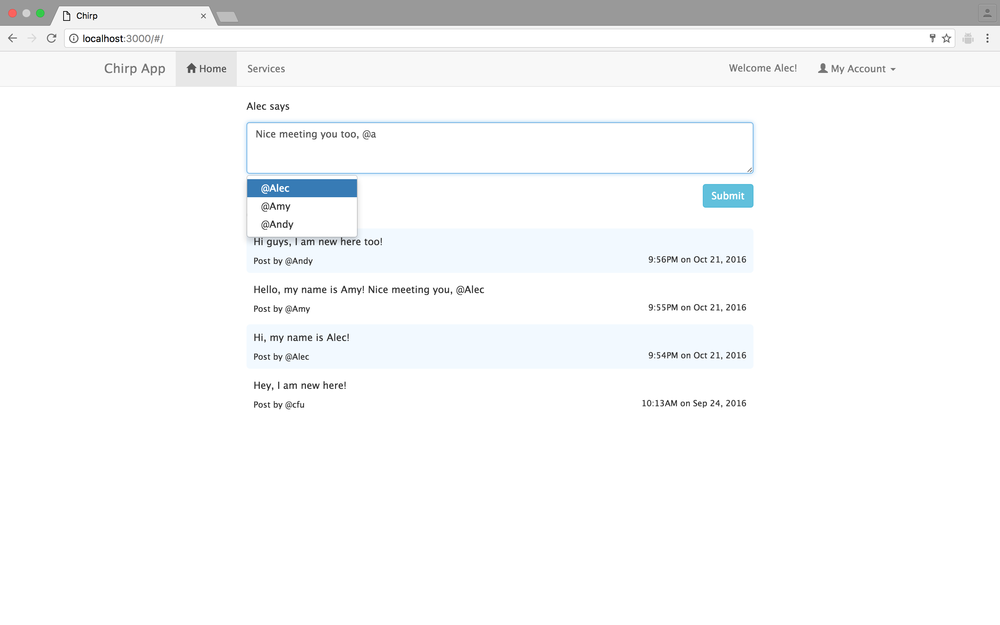
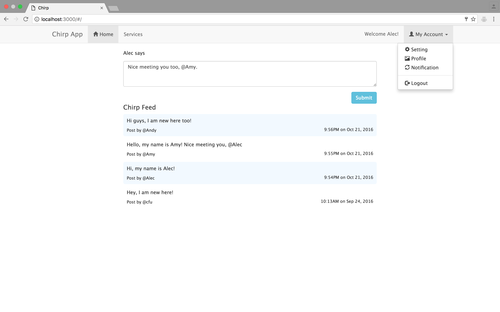

##Modified MEAN Stack Twitter Clone App From Microsoft Virtual Academy

### What is new? 
The study example from Microsoft Virtual Academy didn't implement client session, which causes user to be logout every time when the page is refreshed. This example does client session handling through AngularJS module ngCookies. It is a simplified implementation just for demo purpose. Besides, api routes in this example are implemented only through HTTP calls without using ngResources.  

This application also incorporates [Mention.js](https://github.com/jakiestfu/Mention.js/) to have the @user functionality.

###Prerequisite
1. Node.js -- https://nodejs.org/
2. Mongodb -- https://www.mongodb.com/

### How to Run?
1. install the prerequisites
2. clone github repository: https://github.com/ctfu/ChirpApp.git
3. terminal run: `npm install`
4. terminal run:`mongod` (some operating system might need sudo permission)
5. terminal run: `npm start`
6. browser: `localhost:3000`

### Screen Shot

###License

(The MIT license)

Permission is hereby granted, free of charge, to any person obtaining a copy of this software and associated documentation files (the "Software"), to deal in the Software without restriction, including without limitation the rights to use, copy, modify, merge, publish, distribute, sublicense, and/or sell copies of the Software, and to permit persons to whom the Software is furnished to do so, subject to the following conditions:

The permission notice shall be included in all copies or substantial portions of the Software.

THE SOFTWARE IS PROVIDED "AS IS", WITHOUT WARRANTY OF ANY KIND, EXPRESS OR IMPLIED, INCLUDING BUT NOT LIMITED TO THE WARRANTIES OF MERCHANTABILITY, FITNESS FOR A PARTICULAR PURPOSE AND NONINFRINGEMENT. IN NO EVENT SHALL THE AUTHORS OR COPYRIGHT HOLDERS BE LIABLE FOR ANY CLAIM, DAMAGES OR OTHER LIABILITY, WHETHER IN AN ACTION OF CONTRACT, TORT OR OTHERWISE, ARISING FROM, OUT OF OR IN CONNECTION WITH THE SOFTWARE OR THE USE OR OTHER DEALINGS IN THE SOFTWARE.

